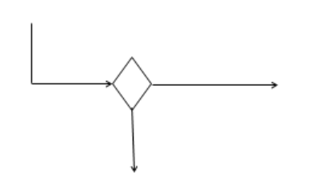
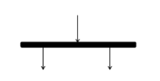

# [BUỔI 5] - DEV THÌ KHÔNG CHỈ VIẾT CODE

<!-- TOC -->
* [[BUỔI 5] - DEV THÌ KHÔNG CHỈ VIẾT CODE](#bui-5---dev-th-khng-ch-vit-code)
  * [1. Version control là gì và tại sao cần dùng nó?](#1-version-control-l-g-v-ti-sao-cn-dng-n)
    * [Tác dụng của VCS](#tc-dng-ca-vcs)
  * [2.Các khái niệm về Git](#2cc-khi-nim-v-git)
    * [Git là gì?](#git-l-g)
    * [Một số thuật ngữ quan trọng](#mt-s-thut-ng-quan-trng)
      * [2.1 Repository](#21-repository)
      * [2.2 Brand và Checkout](#22-brand-v-checkout)
      * [2.3 Commit](#23-commit)
      * [2.4 Merge](#24-merge)
      * [2.5 Pull](#25-pull)
      * [2.6](#26)
      * [2.7 Clone](#27-clone)
      * [2.8 Fork](#28-fork)
  * [3. Pull request](#3-pull-request)
    * [Pull Request là gì?](#pull-request-l-g)
    * [Khi nào cần Pull request](#khi-no-cn-pull-request)
    * [Cách tạo 1 Pull request trên Github](#cch-to-1-pull-request-trn-github)
  * [4. UML là gì? Lí do cần vẽ UML](#4-uml-l-g-l-do-cn-v-uml)
    * [UML là gì?](#uml-l-g)
    * [Tại sao cần vẽ UML](#ti-sao-cn-v-uml)
  * [5. Mô hình Class Diagram, Activity Diagram](#5-m-hnh-class-diagram-activity-diagram)
    * [5.1 Class Diagram](#51-class-diagram)
      * [Định nghĩa](#nh-ngha)
      * [Các tính chất cơ bản của class diagram](#cc-tnh-cht-c-bn-ca-class-diagram)
      * [Access Modifier trong class diagram](#access-modifier-trong-class-diagram)
      * [Relationship trong class diagram](#relationship-trong-class-diagram)
      * [Multiplicity trong class diagram](#multiplicity-trong-class-diagram)
    * [5.2 Activity Diagram](#52-activity-diagram)
      * [Lợi ích của Activity Diagram](#li-ch-ca-activity-diagram)
      * [Các thành phần trong Activity Diagram](#cc-thnh-phn-trong-activity-diagram)
<!-- TOC -->

## 1. Version control là gì và tại sao cần dùng nó?

Trong kỹ nghệ phần mềm, một hệ thống quản lý phiên bản (còn viết là VCS theo từ tiếng Anh Version control systems) là một hệ thống lưu giữ các phiên bản của mã nguồn của sản phẩm phần mềm, giúp các lập trình viên có thể dễ dàng lấy lại phiên bản mong muốn.

VCS nghĩa là hệ thống giúp lập trình viên có thể lưu trữ nhiều phiên bản khác nhau của một mã nguồn được nhân bản (clone) từ một kho chứa mã nguồn (repository), mỗi thay đổi vào mã nguồn trên local sẽ có thể ủy thác (commit) rồi đưa lên server nơi đặt kho chứa chính.

### Tác dụng của VCS

1. Lưu lại lịch sử các version của bất kỳ thay đổi nào của dự án. Giúp xem lại các sự thay đổi hoặc khôi phục (revert) lại sau này.

2. Việc chia sẻ code trở nên dễ dàng hơn, lập trình viên có thể để public cho bất kỳ ai, hoặc private chỉ cho một số người có thẩm quyền có thể truy cập và lấy code về.

## 2.Các khái niệm về Git

### Git là gì?

Git là một hệ thống quản lý phiên bản phân tán (Distributed Version Control System – DVCS), nó là một trong những hệ thống quản lý phiên bản phân tán phổ biến nhất hiện nay. Git cung cấp cho mỗi lập trình viên kho lưu trữ (repository) riêng chứa toàn bộ lịch sử thay đổi.

### Một số thuật ngữ quan trọng


#### 2.1 Repository

Hiểu đơn giản thì Repository là kho lưu trữ. Đây là nơi lưu trữ tất cả những thông tin cần thiết để duy trì và quản lý các sửa đổi và lịch sử của dự án (nơi trữ source code và các thay đổi trên đống source code này)

**Có hai loại repository:**

- Local Repository: là repository nằm trên chính máy tính của chúng ta, repository này sẽ đồng bộ hóa với remote repository bằng các lệnh của git.

- Remote Repository: là repository được cài đặt trên server chuyên dụng. Ví dụ: GitHub, GitLab, Bitbucket,...

Khi tự khởi tạo một repository, chúng ta gõ lệnh `$ git init`, lệnh này sẽ tạo ra một thư mục .git và đây chính là **repository** còn phần code nằm cùng với thư mục `.git` được gọi là **Working Directory**

>Sau khi gõ lệnh git init, nếu nhận được thông báo như sau thì việc thực hiện tạo repository đã thành công
>
>```java
>Initialized empty Git repository in path_to_folder/.git/
>```

#### 2.2 Brand và Checkout


Branch là nhánh, checkout một branch nghĩa là tạo một nhánh mới từ một nhánh nào đó. Tóm lại đây là khái niệm khi dùng để phân nhánh và những thao tác sẽ được lưu trữ trên nhánh hiện tại, không làm ảnh hưởng đến nhánh cũ.

Muốn phát triển một tính năng mới mà đảm bảo vẫn có thể dễ dàng khôi phục lại trạng thái trước đó thì một trong những cách có thể áp dụng là tạo một branch mới và thao tác trên đó như sau:

```java
$ git branch <branch-name>
```
sau đó checkout sang branch vừa tạo hoặc dùng lệnh sau để tạo branch mới và đồng checkout sang branch vừa tạo
```java
$ git checkout -b <branch-name>
```
#### 2.3 Commit

Là thao tác để lưu lại trạng thái hiện tại trên hệ thống, ghi nhận lại lịch sử các xử lý: thêm, xóa, cập nhật các file hay thư mục trên repository.

Khi thực hiện, repository sẽ ghi lại sự khác biệt giữa lần commit trước so với hiện tại. Chúng được ghi nối tiếp nhau theo thứ tự thời gian. Do đó, ta có thể xem lại lịch sử thay đổi trong quá khứ dựa theo các commit trước đó.

Để thực hiện một commit, bạn sử dụng lệnh sau: `$ git add .` nếu muốn lưu lại tất cả những file đã thay đổi, thêm, xóa,... hoặc `$ git add path_to_file1 path_to_file2` để lưu lại thay đổi chỉ những files mà bạn muốn

Tiếp theo chạy lệnh `$ git commit -m "Nội dung muốn commit"` để commit các thay đổi đã lưu lại ở trên.

#### 2.4 Merge

Là việc hợp nhất một nhánh phát triển hoặc hợp nhất lịch sử thay đổi vào nhánh khác.

Ví dụ bạn phát triển xong 1 tính năng, đã test/kiểm tra các kiểu và thấy nó hoàn chỉnh, có thể tích hợp vào phần mềm thì bạn sẽ tiến hành merge code.

```java
$ git merge <branch-name>
```

Giả sử có 2 branchs cần merge như sau:


Sau khi sử dụng merge:


#### 2.5 Pull

Là hành động cập nhật các thay đổi xuống local repo.

```java
$ git pull origin <branch_name>.
```
Ví dụ: Trong khi bạn đang code trên một file thì một người bạn trong nhóm của bạn cũng code trên một file khác cùng branch, người bạn đó hoàn thành công việc, commit và push lên remote repo. Lúc này bạn muốn lấy những thay đổi mà người bạn của bạn đã thực hiện thì bạn sẽ thực hiện hành động Pull xuống.

#### 2.6

Là hành động đưa những thay đổi đã commit lên một branch nào đó ở remote repository hoặc một branch mới hoàn toàn lên remote repository. Sau khi push lên thì các thành viên của team có thể thấy và đồng bộ code xuống máy local.

```java
$ git push origin <branch_name>
```

#### 2.7 Clone

Sao chép một repository có sẵn về local.

```java
git clone /đường-dẫn-đến-repository/
```


#### 2.8 Fork

Khái niệm này trên Github, là hành động tạo một bản sao của repository gốc thành một repository của bạn. Việc fork một repository cho phép bạn dễ dàng chỉnh sửa, thay đổi source code mà không ảnh hưởng tới source gốc.

## 3. Pull request

### Pull Request là gì?

Pull Request là một tính năng của hệ thống quản lý mã nguồn (source control management) như Git, GitHub, hay GitLab. Nó là một cách để người dùng có thể đề xuất thay đổi vào mã nguồn của một dự án đã được lưu trữ trên hệ thống quản lý mã nguồn đó.

### Khi nào cần Pull request

Khi một người dùng muốn đóng góp vào một dự án, họ có thể tạo một branch (nhánh) riêng từ branch chính (thường là branch master), thực hiện các thay đổi cần thiết trong branch này, rồi đưa các thay đổi lên remote repository và tạo một pull request. Pull request bao gồm các thông tin về các thay đổi đã thực hiện, các commit mới, các nhận xét, v.v. Người sở hữu dự án hoặc các thành viên khác của dự án có thể xem và kiểm tra các thay đổi trước khi chấp nhận hoặc từ chối pull request.

### Cách tạo 1 Pull request trên Github

- Bước 1: Fork dự án gốc

  - Truy cập vào dự án gốc trên GitHub.

  - Nhấn vào nút “Fork” ở góc trên bên phải để sao chép dự án vào tài khoản của bạn.
- Bước 2: Clone dự án về máy
  - Truy cập vào repository đã fork trong tài khoản của bạn.

  - Sao chép URL của repository.

  - Mở Terminal và sử dụng lệnh `git clone` để clone dự án về máy. 

- Bước 3: Tạo nhánh mới
  - Mở Terminal trong thư mục dự án đã clone.
  - Sử dụng lệnh `git checkout -b [tên_nhánh]` để tạo và chuyển đổi sang một nhánh mới.
- Bước 4: Thực hiện thay đổi
  - Mở dự án trong trình chỉnh sửa mã nguồn.
  - Thực hiện các thay đổi cần thiết và lưu lại.
- Bước 5: Commit và Push

  - Mở Terminal và sử dụng lệnh `git add .` để thêm các thay đổi vào danh sách commit.
  - Sử dụng lệnh `git commit -m "Mô tả commit"` để commit các thay đổi đã thêm.
  - Sử dụng lệnh `git push origin [tên_nhánh]` để đẩy thay đổi lên repository của bạn trên GitHub.
- Bước 6: Tạo Pull Request

  - Truy cập vào repository của bạn trên GitHub.
  - Nhấn vào nút **“Compare & pull request”** bên cạnh tên nhánh của bạn.
  - Điền thông tin cần thiết, mô tả về Pull Request và nhấn **“Create Pull Request“**.
- Bước 7: Kiểm tra và xử lý yêu cầu chỉnh sửa

    - Nhóm quản lý dự án sẽ xem xét và thảo luận về Pull Request của bạn.

    - Nếu cần chỉnh sửa, bạn chỉ cần thêm commit vào nhánh đã tạo và Pull Request sẽ tự động cập nhật.
- Bước 8: Pull Request được chấp nhận và merge

  - Sau khi Pull Request đạt yêu cầu, nhóm quản lý sẽ chấp nhận và merge vào nhánh chính.
  - Code của bạn đã được hợp nhất vào dự án gốc.

## 4. UML là gì? Lí do cần vẽ UML

### UML là gì?

Ngôn ngữ mô hình hóa thống nhất (tiếng Anh: Unified Modeling Language, viết tắt thành UML) là một ngôn ngữ mô hình gồm các ký hiệu đồ họa mà các phương pháp hướng đối tượng sử dụng để thiết kế các hệ thống thông tin một cách nhanh chóng.

UML sử dụng một hệ thống ký hiệu thống nhất biểu diễn các Phần tử mô hình (model elements). Tập hợp các phần tử mô hình tạo thành các Sơ đồ UML (UML diagrams). Có các loại sơ đồ UML chủ yếu sau:

- Sơ đồ lớp (Class Diagram)
- Sơ đồ đối tượng (Object Diagram)
- Sơ đồ tình huống sử dụng (Use Cases Diagram)
- Sơ đồ trình tự (Sequence Diagram)
- Sơ đồ cộng tác (Collaboration Diagram hay là Composite Structure Diagram)
- Sơ đồ trạng thái (State Machine Diagram)
- Sơ đồ thành phần (Component Diagram)
- Sơ đồ hoạt động (Activity Diagram)
- Sơ đồ triển khai (Deployment Diagram)
- Sơ đồ gói (Package Diagram)
- Sơ đồ liên lạc (Communication Diagram)
- Sơ đồ tương tác (Interaction Overview Diagram - UML 2.0)
- Sơ đồ phối hợp thời gian (Timing Diagram - UML 2.0)

### Tại sao cần vẽ UML

Các sơ đồ (class, sequence, E-R, database…) được vẽ ra để:

- Trực quan hóa: giúp người thiết kế dễ dàng nhìn thấy các thực thể, các mối quan hệ, tìm ra các vấn đề có thể xảy ra và xây dựng bước thiết kế tiếp theo.

-  Xây dựng tài liệu giúp tra cứu lại sau này, giúp các thành viên mới tham gia vào dự án có thể hiểu được.

- Trao đổi thông tin giữa các thành viên trong dự án khi thiết kế.

## 5. Mô hình Class Diagram, Activity Diagram

### 5.1 Class Diagram

#### Định nghĩa
- Class diagram mô tả kiểu của các đối tượng trong hệ thống và các loại quan hệ khác nhau tồn tại giữa chúng.
- Là một kỹ thuật mô hình hóa tồn tại ở tất cả các phương pháp phát triển hướng đối tượng.
- Biểu đồ hay dùng nhất trong UML và gần gũi nhất với các lập trình viên.
- Giúp các lập trình viên trao đổi với nhau và hiểu rõ ý tưởng của nhau.

#### Các tính chất cơ bản của class diagram
- Tên class
- Attribute (field, property)
- Operation (method, function)


Ví dụ khai báo tên, attribute, operation kèm theo kiểu trả về của 1 class:


#### Access Modifier trong class diagram

- Sử dụng để đặc tả phạm vi truy cập cho các Attribute và Operation của 1 class (Cấp quyền cho các class khác sử dụng Attribute và Operation của class này).

- Có 4 lựa chọn phạm vi truy cập:

    - Private ( - ): Chỉnh mình các đối tượng được tạo từ class này có thể sử dụng.

    - Public ( + ): Mọi đối tượng đều có thể sử dụng.

    - Protected ( # ): Chỉ các đối tượng được tạo từ class này và class kế thừa từ class này có thể sử dụng.

    - Package/Default: Các đối tượng được tạo từ class trong lớp cùng gói có thể sử dụng.

#### Relationship trong class diagram

- Sử dụng để thể hiện mỗi quan hệ giữa đối tượng được tạo từ 1 class với các đối tượng được tạo từ class khác trong class diagram.

- Có 4 loại Relationship:
    
    - Composition: Đối tượng tạo từ lass A mất thì đối tượng tạo từ class B sẽ mất. 
    - Inheritance: 1 class kế thừa từ 1 class khác.
    - Association: 2 class có liên hệ với nhau nhưng không chỉ rõ mối liên hệ.
    - Agreegation: Đối tượng tạo từ lass A mất thì đối tượng tạo từ class B vẫn tồn tại độc lập.

    

VD về Class Diagram:


#### Multiplicity trong class diagram

Sử dụng để thể hiện quan hệ về số lượng giữa các đối tượng được tạo từ các class trong class diagram
- 0...1: 0 hoặc 1
- n : Bắt buộc có n
- 0...* : 0 hoặc nhiều
- 1...* : 1 hoặc nhiều
- m...n: có tối thiểu là m và tối đa là n

### 5.2 Activity Diagram

Activity Diagram là một mô hình logic dùng để mô hình hóa các hoạt động trong một quy trình nghiệp vụ.

Activity diagram sử dụng một tập hợp các ký hiệu chuyên biệt — bao gồm các ký hiệu được sử dụng để mô tả điểm bắt đầu, kết thúc, điểm hợp nhất hoặc tiếp nhận các bước trong quy trình — để hình thành nên biểu đồ hoạt động.

####  Lợi ích của Activity Diagram

1. [x] Thể hiện logic của một thuật toán.
2. [x] 
3. [x] Mô tả các bước được thực hiện trong một UML use case.
4. [x] 
5. [x] Minh họa quy trình nghiệp vụ hoặc quy trình làm việc giữa người dùng và hệ thống.
6. [x] 
7. [x] Đơn giản hóa và cải thiện bất kỳ quy trình nào bằng cách làm rõ các UC phức tạp.
8. [x] 
9. [x] Mô hình hóa các yếu tố kiến trúc phần mềm, chẳng hạn như phương pháp, chức năng và hoạt động.

#### Các thành phần trong Activity Diagram

1. Start

    Ký hiệu: 
   
    Đặc điểm:

    - Khởi tạo một hoạt động.

    - Một activity diagram có thể có nhiều trạng thái Start.
2.  Transition

    Ký hiệu:  

    Đặc điểm: Mô tả sự chuyển đổi trạng thái của các hoạt động
3. Activity
    
    Ký hiệu: 

   Đặc điểm:

    - Mô tả hành vi của đối tượng trong quy trình

    - Tên hoạt động phải ngắn gọn, đủ nghĩa. Nên đặt là động từ và mô tả đầy đủ ý nghĩa tổng thể của hoạt động nhất có thể.

4. Decision

    Ký hiệu: 

   - Đặc điểm: Đây là kí hiệu biểu thị nút điều kiện chuyển hướng. Tùy theo trường hợp đúng hay sai của kết quả mà có hướng di chuyển tiếp theo tương ứng.

    - Decision bao gồm hai loại sau: Branch và Merge

- **_Branch_**

    Ký hiệu:  

  Đặc điểm:

    - Mô tả điều kiện rẽ nhánh
    - Chỉ một dòng điều khiển đi vào
    - Hai hoặc nhiều dòng điều khiển đi ra
    - Chỉ một dòng điều khiển dẫn đến kết quả
    - Mỗi dòng chứa một điều kiện (guard), guard phải liên quan đến điều kiện và loại trừ nhau

- **_Merge:_**
    
    Ký hiệu: 

  Đặc điểm:

    - Có hai hoặc nhiều dòng điều khiển đi vào

    - Chỉ một dòng điều khiển đi ra

5.  Synchronization bar

    Ký hiệu: 

    Đặc điểm:

    - Khi có các trường hợp cần hội tụ đủ nhiều luồng điều khiển một lúc để gộp thành một luồng xử lí thì cần dùng JOIN.

    - Khi cần phải tách một luồng điều khiển ra hai hoặc nhiều luồng khác biệt nhau thì cần dùng FORK. Mỗi luồng của FORK hoàn toàn không lệ thuộc nhau.

- **_Join:_**
    
    Ký hiệu: 

  Đặc điểm:

    - Kết hợp các dòng điều khiển song song (FORK)

    - Có hai hoặc nhiều dòng điều khiển vào

    - Chỉ có một dòng điều khiển ra, dòng điều khiển ra được tạo khi tất cả các dòng cần thiết đã vào

- **_Fork:_**
    
    Ký hiệu: 

  Đặc điểm:

    - Mô tả một dòng điều khiển được tách ra thực hiện song song

    - Chỉ có một dòng điều khiển đi vào

    - Có hai hoặc nhiều dòng điều khiển đi ra

    - Dùng FORK khi các hoạt động thực hiện không quan tâm thứ tự

6. End

    Ký hiệu: 

   Đặc điểm:

    - Mô tả trạng thái kết thúc quy trình

    - Một activity diagram có thể có một hoặc nhiều trạng thái kết thúc